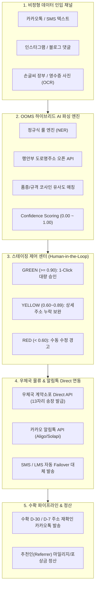

# OOMS (Unstructured Order Management System) 기술 아키텍처 및 상세 설계 사양서
**Author:** 20+ Years Principal E-Commerce & ERP Chief Architect  
**Domain:** B2B2C 농산물 산지직송 직거래 플랫폼 (Unstructured Ingest & Post-Office Logistics)  
**Target Environment:** Google Antigravity / FastAPI / PostgreSQL 16+ / React 18 PWA  

---

## 1. 아키텍처 개요 및 설계 철학

전통적인 전자상거래는 정형화된 장바구니-체크아웃 모델에 의존합니다. 하지만 농산물 산지직송 직거래(B2B2C) 시장의 실제 현장은 다음과 같은 고유한 기술적 병목을 가지고 있습니다:

1. **인입 채널의 극단적 비정형성 (Unstructured Ingestion)**:
   - 주문의 70% 이상이 카카오톡, 문자메시지, 인스타그램 DM, 혹은 수기 메모 사진 형태로 인입됩니다.
   - 주소 표기 방식이 비표준이며, 건물명 누락, 상세 동/호수 누락, 신/구 지번 혼용이 빈번합니다.
2. **시즌성 수확 예약 파이프라인 (Pre-Order Lifecycle)**:
   - 수확 1~2개월 전(D-60, D-30) 선주문을 받고 수확기(D-Day)에 일괄 발송되므로, 발송 직전 고객 주소 변경 및 수령지 재확인이 필수적입니다.
3. **고령 농가(50-70대) 현장 조작성 (Usability)**:
   - 복잡한 ERP 화면은 현장 이탈을 유발합니다. 한 손 조작(Mobile-First), 원터치 입금확인, 우체국 등기 송장 자동 연동 및 카카오 알림톡 자동 통지가 제공되어야 합니다.

본 시스템은 **"Managed Service Model (플랫폼 총괄 대행)"**을 채택하여, 플랫폼 관리자가 AI 정제 및 우체국 계약 물류를 중앙에서 제어하고, 농가는 농업 본연과 수주 확인에만 집중할 수 있도록 구성되었습니다.

---

## 2. 시스템 아키텍처 다이어그램

---

## 3. 핵심 모듈별 상세 사양

### 3.1 하이브리드 AI 파싱 엔진 (Hybrid Parser)
- **정규식 룰 엔진**: 
  - 주문자/수령인 분리 (`보내는분`, `받는분`, `수령인` 키워드 기반)
  - 전화번호 정규화 (`01[016789]-xxxx-xxxx` 통일)
  - 선물용 인사말 카드 문구(`인사말:`, `문구:`) 및 배송 메모 분리
- **행안부 도로명주소 API 실시간 정제**:
  - `https://business.juso.go.kr/addrlink/openApi/searchApi.do`
  - 표준 도로명주소, 5자리 기초구역 우편번호, 건물관리번호(`bdMgtSn`) 획득
  - 실패 시 오프라인 정규식 스마트 폴백 엔진 가동
- **신뢰도 평가 알고리즘 (Confidence Score Matrix)**:
  | 평가 항목 | 가중치 | 판정 기준 |
  |---|---|---|
  | 주문자 식별 | 15% | 성명(2~4자 한글) + 휴대폰 유효성 |
  | 수령인 식별 | 20% | 수령인 성명 + 배송지 연락처 확인 |
  | 도로명주소 표준화 | 25% | 행안부 API 매칭 성공 여부 |
  | 상세주소 유효성 | 10% | 동/호수/층 등 구체적 배송처 기재 여부 |
  | 5자리 우편번호 | 10% | 신규 기초구역번호 유효성 |
  | 상품 마스터 매칭 | 15% | 품종/규격 키워드 코사인 유사도 |
  | 수량 명시 여부 | 5% | 박스/상자 단위 명시 여부 |

### 3.2 우체국 계약소포 Direct API 모듈
- 우체국 계약 10자리 고객번호(`post_office_customer_num`) 및 승인번호 연동
- 계약소포 신청 전문 송신 시 우체국 13자리 등기 운송장 번호(`689-xxxx-xxxx-x`) 즉시 반환
- 주문 상태를 `INVOICE_ISSUED`로 갱신하고 발급 일시 기록

### 3.3 카카오 알림톡 & Failover 대체 발송
- 템플릿 변수 치환: `#{주문자명}`, `#{수령인명}`, `#{상품명}`, `#{운송장번호}`, `#{배송추적URL}`
- 알림톡 수신 실패 또는 카카오톡 미설치 고객 대상 `failover=Y` 설정으로 LMS/SMS 즉시 대체 전송

### 3.4 수확 사전예약(Pre-Order) 엔진
- 수확 30일/7일 전 크론/스케줄러에 의한 자동 트리거
- 1-Click 모바일 확인 URL(`domain.com/pre-order/confirm/{id}`)을 고객에게 발송
- 이사나 선물 대상자 변경 등 배송지 주소 변경을 수확 전 완벽 방어

---

## 4. 보안 및 트랜잭션 무결성
- **RBAC (역할 기반 접근 제어)**:
  - `PLATFORM_ADMIN`: AI 스테이징 승인, API 키 관리, 수수료 및 정산 통제
  - `MERCHANT`: 내 농가 주문 조회, 원터치 입금확인 토글, 스토리 발행
  - `CUSTOMER`: 비정형 주문 접수, 배송지 주소 재확인
- **데이터베이스 트리거**:
  - 주문 생성/취소 시 품목별 `current_reserved_qty` 자동 가감 트리거로 초과 예약(Overbooking) 방지
- **트랜잭션 격리수준**: Read Committed 및 비관적/낙관적 락을 통한 재고 선점 보장
